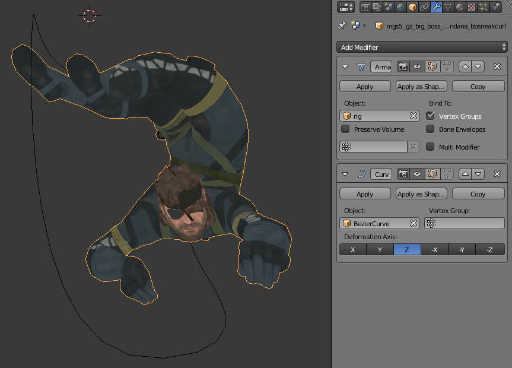
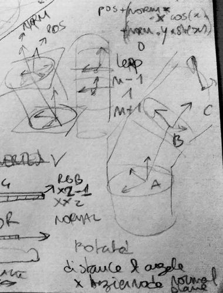
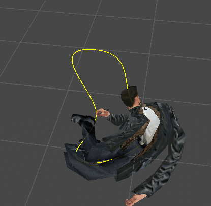
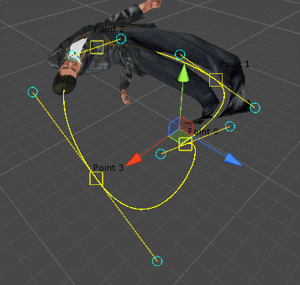
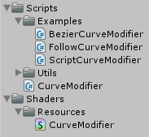
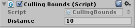
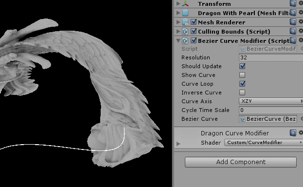
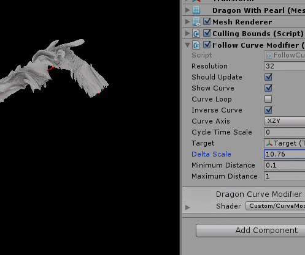

# What is happening in this gif ?

A 3D model of a dragon is being deformed in real-time along a curve with a vertex shader.  
The curve is made by following a physicalized box.  


# The story behind a gif

I've discovered the **curve modifier** in [Blender](https://www.blender.org) and really love it.  
People on Twitter went crazy with the gif below, so I always wanted to share how to do it.


  

# And ?

One night I couldn't sleep, because I had an intuition.  
I thought I could make the maths for the curve modifier above.  



Turns out it is always more complicated than excepted.  
It took me time to figure out the geometry involved.  
Struggling with maths is hard and frustrating.  
But what a satisfaction when things work!  

#### No interpolation
The gif below is the first tentative.  
It looks cool, but it is not perfect.  
It needs a smooth linear interpolation.  



#### With interpolation
This is mainly because I used an array of float to pass positions to the shader.  
And I've discovered that you could just send float within a texture.  
It's great because texture gets a linear interpolation filter.



#### Warning
It is almost working like a charm, but my curve modifier still got weird glitches.  
I guess I'm fine with it since I'm just doing it to mess with shaders.  

# Let's do it in Unity3D with a vertex shader !

In this repository, you will find the scripts and the shader.  



The **CurveModifier.cs** is the base script used to simplify different cases of application.  
His main function is to translate an array of vector into a texture.  
An important information is that the texture format is **RGBAFloat**.  
It allows the texture to store 32 bit floats, and so positions.  

#### Simplified version of what CurveModifier.cs does
```javascript
void Init () {
  texture = new Texture2D(resolution, 1, TextureFormat.RGBAFloat, false);
  colorArray = new Color[resolution];
  vectorArray = new Vector3[resolution];
}

// Get a curve point with a clamped ratio
public Vector3 GetCurvePoint (float ratio) {
  return vectorArray[ (int) Mathf.Floor ( vectorArray.Length * ratio ) ];
}

// Store points into a texture
public void CurveToTexture () {
	for (int i = 0; i < resolution; ++i) {
		float ratio = i / (float)resolution;
		Vector3 p = GetCurvePoint(ratio);
		colorArray[i] = new Color(p.x, p.y, p.z, 0.0);
	}
	texture.SetPixels(colorArray);
	texture.Apply();
}
```

So for example we can use a Bezier Curve like [this one on the Asset Store](https://www.assetstore.unity3d.com/#!/content/11278).  
And then just fill the vector array with the bezier points.  
You can check **BezierCurveModifier.cs** that uses the bezier package.  

#### Let's get scared at looking the vertex shader
```javascript
// this function set the vertex position
v2f vert (appdata v)
{
	// unity stuff
	v2f o;

	// use transform component
	float4 vertex = mul(_Object2World, v.vertex);

	// axis setup (compress vectors into scalars)
	float vertexForward = vertex.x * _Forward.x + vertex.y * _Forward.y + vertex.z * _Forward.z;
	float vertexRight = vertex.x * _Right.x + vertex.y * _Right.y + vertex.z * _Right.z;
	float vertexUp = vertex.x * _Up.x + vertex.y * _Up.y + vertex.z * _Up.z;

	// the actual clamped ratio position on the curve
	float ratio = abs(vertexForward + _Time.x * _TimeSpeed);
	ratio = lerp(clamp(ratio, 0.0, 1.0), fmod(ratio, 1.0), _ShouldLoop);

	// used to distribute point on the plane that is perpendicular to the curve forward
	float angle = atan2(vertexUp, vertexRight);
	float radius = length(float2(vertexRight, vertexUp));

	// get current point through the texture
	float4 p = float4(ratio, 0.0, 0.0, 0.0);
	float3 bezierPoint = mul(_World2Object, tex2Dlod(_CurveTexture, p));

	// get neighbors of the current ratio
	float unit = 1.0 / _CurveResolution;
	float ratioNext = fmod(ratio + unit, 1.0);
	float ratioPrevious = fmod(ratio - unit + 1.0, 1.0);

	// make things loop or not
	ratioNext = lerp(clamp(abs(ratio + unit), 0.0, 1.0), ratioNext, _ShouldLoop);
	ratioPrevious = lerp(clamp(abs(ratio - unit), 0.0, 1.0), ratioPrevious, _ShouldLoop);

	// get next and previous point through the texture
	p.x = ratioNext;
	float3 bezierPointNext = mul(_World2Object, tex2Dlod(_CurveTexture, p));
	p.x = ratioPrevious;
	float3 bezierPointPrevious = mul(_World2Object, tex2Dlod(_CurveTexture, p));

	// find out vectors
	float3 forward = normalize(bezierPointNext - bezierPoint);
	float3 backward = normalize(bezierPointPrevious - bezierPoint);
	float3 up = normalize(cross(forward, backward));
	float3 right = normalize(cross(forward, up));

	// voila
	vertex.xyz = bezierPoint + right * cos(angle) * radius + up * sin(angle) * radius;

	// unity stuff
	o.vertex = mul(UNITY_MATRIX_MVP, vertex);
	o.uv = TRANSFORM_TEX(v.uv, _MainTex);
	return o;
}
```

Looks like hieroglyphs, right ? I still can't believe it works.  
My methodology is to change a + into a * and watch if things get better.  
And with luck, sometimes you find the right combination.  

# Let's play with the examples

## Things to know about the curve modifier

#### You have to find the right curve axis.  


#### You can change the scale to adjust the curve distribution  


#### Changing position and rotation will have consequences  


#### There is chance that you will need a bigger culling bounds
Because the shader won't change the mesh bounds.  
So the camera can be out of range.  
And the model can disappear from the frustum culling.  



## Things to know about the Bezier Curve modifier

You can modify the spline to change the curve.  


You can change the cycle offset speed.  



## Things to know about the Follow Curve modifier

You can change the how quick you follow the target.  



# Alright folks

Of course there is lot of things left to do. Like bugs fix, solid curve system and better user experience.    
But I am just having fun with vertex shaders on my free time and feel satisfied with the actual prototype.  
Feels free to contact me if you want to improve the project.  

I would love to hear about your project if you are using my shader.  
You can contact me on Twitter : [@leondenise](https://www.twitter.com/leondenise)  
And please share your code like everyone else in this open source community <3
